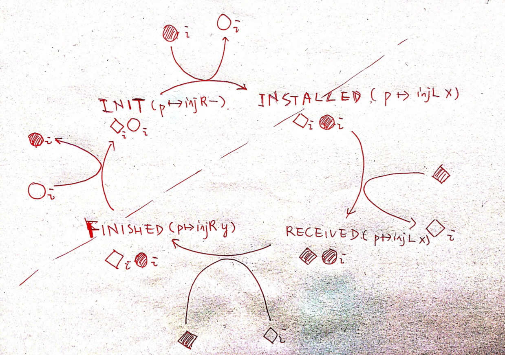

Flat combiner
=====

The flat combiner proofs is based on three major components:

1. Extensive use of *evidence map*, a general implementation of a heap-like structure
2. treiber's stack with per-item invariants
3. helping protocols encoded by exclusive monoids

## Evidence map

The idea is to simulate the heap we already have -- but generalize `loc` as `K` and `val` as `V`. So we can break down the fragmental ownerships, establish agreement over the `K`'s value etc. It is called that way because its generality and a definition called `ev`, which existentially equalifies over the fraction thus serves as kind of a duplicable evidence of existence of some agreed value pointed by certain key.

Concretely:

$$EvMap(K, V) = AUTH(FINMAP(K, FRAC \times AG(V)))$$

$$ev_\gamma(k, v) = \exists q, own_\gamma(\circ \{ k \mapsto (q, Agree(v))\})$$

## Treiber's stack

This stack contains all the "slots" that are used as a location pointing to request/response.

The stack has two layer of specification: The first layer is logically atomic triple style spec, containing `push`, and `pop`. The second layer is built on top of first layer, featuring a global, per-item invariant; it has `push`, and `iter`.

It is also built with the evidence map.

So here is the point:

1. `iter` doesn't have an atomic spec because the implementation just traverses along the link and doesn't enforce any atomicity, for example, guaranteeing that the traversed nodes will stay the same etc.
2. `pop` doesn't have an invariant spec because the invariant is based the model of immutable sharing, thus we can only *know* that some `R` holds for certain element, but we can't get this `R` into local state (since we can't shrink the `evmap` simply by giving an `ev`).

Here are the specs:

### constructor

$$\{ \top \} new\_stack \{s, is\_stack(s) \}$$

### atomic ones

push

$$\langle xs, hd. s \mapsto \#hd* is\_list(hd, xs) \rangle \\
  push(\#s, x) \\
  \langle ret. ret = \#() \land \exists hd', s \mapsto \#hd'* hd' \mapsto SOME(x, \#hd) * is\_list(hd, xs) \rangle$$

pop

$$\langle xs, hd. s \mapsto \#hd* is\_list(hd, xs) \rangle \\
  pop(\#s, x) \\
  \langle ret. (ret = NONE \land xs = [] * s \mapsto \#hd * is\_list(hd, [])) \lor \\
               (\exists x, xs', hd'.ret = SOME(x) \land xs = x::xs' * s \mapsto \#hd' * hd \mapsto_q SOME(x, \#hd') * is\_list(hd', xs'))\rangle$$

### invariant ones

## Protocol

The protocol is based on the previous prototype of a simple helping example. The major difference is:

1. Some of the ghost names are per-item, thus existentially packed inside the per-item invariant of the stack;
2. One ghost name is global and locked, which will be used my the *sole* server.
3. The precondition and post-condition are global, arbitrary timeless conditions that qualify over request. A frame `R` is also added to implement the syncer style spec.

## Problems

The major problem is current flat combiner spec qualifies over a fixed `P` and `Q` in the syncer style spec I derived, which is much more restricted than the universally qualified version. 

The reason why this happens is simple: The `P Q` are encoded as part of the per-item invariant, that is to say, we enforce that for each item the `P, Q` in its state transitions are all the same.

I tried to encode any `P Q` and a hoare triple involving `P, Q, f` inside the *INSTALLED* state. But it seems difficult to confirm that the final `y` satisfies the same `Q`: because when we installed `Q`, we know what `Q` is, but when it is installed, it is existentially qualified, and same till the time of $FINISHED$ state. Thus, when we open the $\exists Q, Q(x, y)$, we don't know if $Q' = Q$.

## Stat

`flat.v`: 440 lines, 1 minute and 30 seconds.

`treiber_stack.v`: 450 lines

`misc.v`: 200 lines
